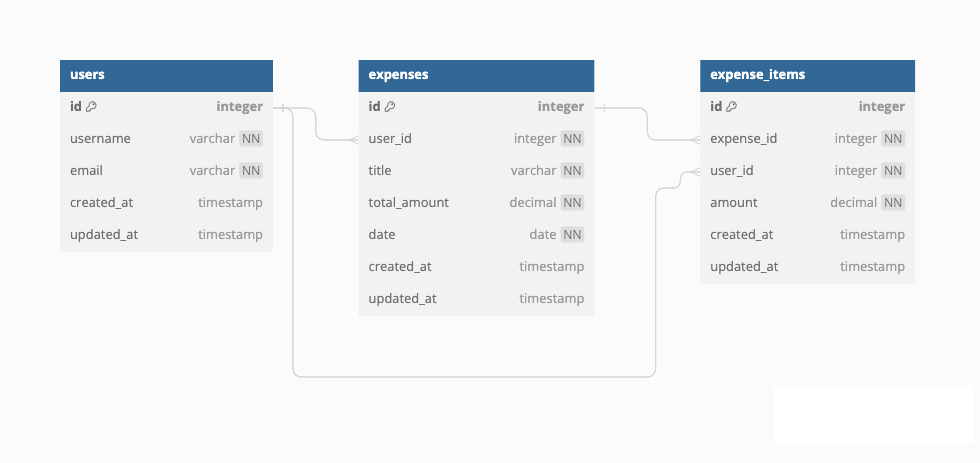

# Paymate

## Overview

The app is designed to make it easier splitting bills in a group. The target audience will be young travellers.

## Dev Instructions

**Front-End:**

1. run 'npm i' to set up node modules
2. run 'npm start'

**Back-End:**

1. set up an .env file
2. run 'npm run migrate'
3. run 'npm run seed'
4. run 'npm run dev'

### Problem

When travelling with a group of friends, there are often group bills that are accumalated and are difficult to keep track of. Paymate aims to make the process simplier and easier to share expenses.

### User Profile

Young travelers:

- looking to keep track of shared expenses with friends
- wanting to split bills easily
- needing to see their share of expenses clearly

### Features

**MVP:**

- As a user, I want to be able to see my expenses
- As a user, I want to be able to add an expense
- As a user, I want to be able to edit an expense
- As a user, I want to be able to delete an expense

**Future Features:**

- As a user, I want to create an account to managed my shared expenses.
- As a user, I want to log in to my account to managed shared expenses.
- As a user, I want to create groups for different trips or events.
- As a user, I want to add friends to my groups.
- As a logged in user, I want record expenses for each group.
- As a logged in user, I want to split expenses among group members.
- As a logged in user, I want to see the total expenses for each group.
- As a logged in user, I want to see the balance owed or due for each member in a group.

## Implementation

### Tech Stack

- React
- MySQL
- Express
- Client libraries:
  - react
  - react-router
  - axios
  - sass
- Server libraries:
  - knex
  - express

### APIs

- No external APIs will be used for the first sprint

### Sitemap

- Login
- Dashboard
- Add expense
- Edit expense


### Mockups

#### Login Page


#### HomePage (Dashboard)

")

#### Add New Expense Page


#### Edit Expense


### Data



### Endpoints

**GET /expenses/your-expenses**

- Get all expenses for user

Response:

```
[
   {
    "expense_id": 1,
    "title": "Dinner at Jacks",
    "total_amount": "200.00",
    "date": "2024-03-03T08:00:00.000Z",
    "created_at": "2024-06-11T14:01:46.000Z",
    "updated_at": "2024-06-11T14:01:46.000Z"
  },
  {
    "expense_id": 2,
    "title": "Dinner at Joey's",
    "total_amount": "255.00",
    "date": "2024-03-18T07:00:00.000Z",
    "created_at": "2024-06-11T14:47:30.000Z",
    "updated_at": "2024-06-11T14:47:30.000Z"
  }
]
```

**POST /expenses/user**

- Crete an expense for a user

Response:

```
[
  {
    "id": 12,
    "user_id": 1,
    "title": "Breakfast at Jones",
    "total_amount": "75.00",
    "date": "2024-06-02T07:00:00.000Z",
    "created_at": "2024-06-12T15:28:42.000Z",
    "updated_at": "2024-06-12T15:28:42.000Z"
  }
]
```

**PUT /expenses/:id**

- Update an expense

Response:

```
[
  {
    "id": 12,
    "user_id": 1,
    "title": "Breakfast at Cool Club",
    "total_amount": "75.00",
    "date": "2024-06-02T07:00:00.000Z",
    "created_at": "2024-06-12T15:28:42.000Z",
    "updated_at": "2024-06-12T15:28:42.000Z"
  }
]
```

**DELETE /expenses/:id**

- Delete an expense

Response:

```
[
  {
    "message": "Expense successfully deleted."
  }
]
```

### Auth

- There will be no auth on the first sprint

## Roadmap

- Create client

  - react project with routes and boilerplate pages

- Create server

  - express project with routing, with placeholder 200 responses

- Create migrations

- Gather sample data

  - collect sample expense data

- Create seeds with sample data

- Deploy projects

  - Deploy client and server projects so all commits will be reflected in production

- Feature: View homepage

  - Implement view homepage to display expenses
  - Create GET /expenses/your-expenses endpoint

- Feature: Add expense to user

  - Add form input to add expense
  - create POST /expenses/user endpoint

- Feature: Update expenses

  - Implement update group form
  - Create PUT /expenses/:id
    endpoint

- Feature: delete expense

  - implement a modal to delete an expense
  - create delete/expenses/:id endpoint

- Bug fixes

- DEMO DAY

## Nice-to-haves

- Add page not found
- Add group functionality
- Add member functionality

## Future features

- Add authentication to the app
- Add a currency conversion API
- Add notification via a third party API (sending email notifications)
- Forgot password functionality
- Add photo upload for avatars
- Add search functionality
- Add categories to groups
- Add categories to expenses
